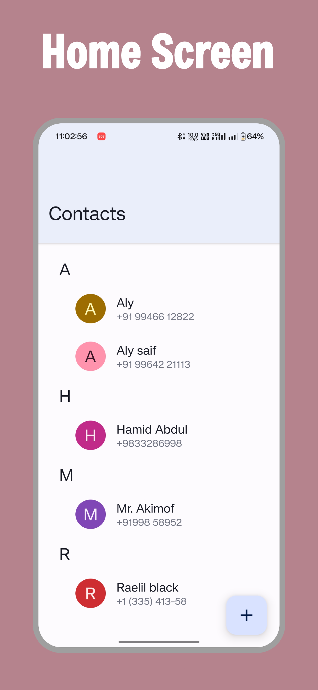
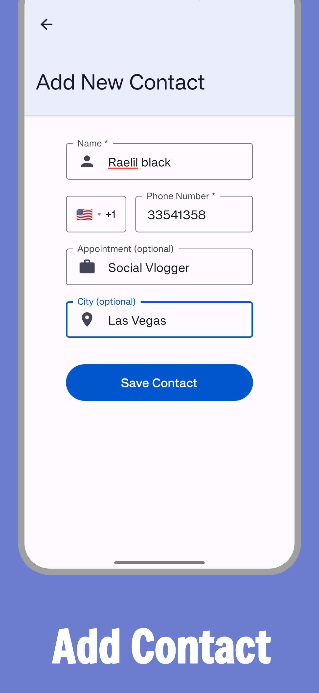
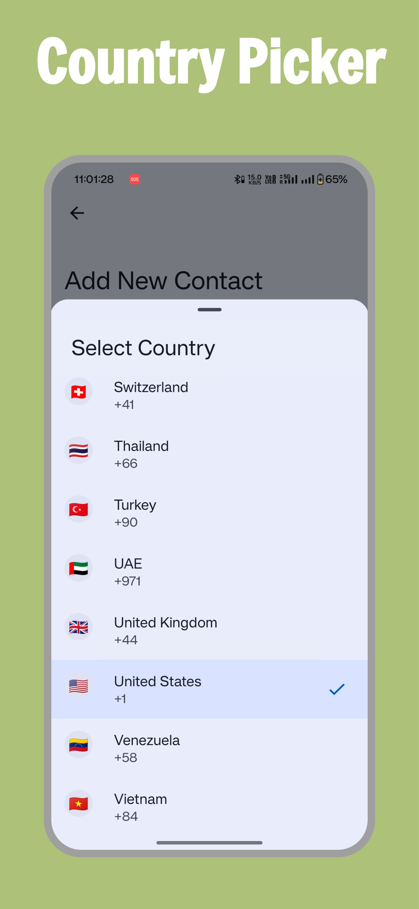
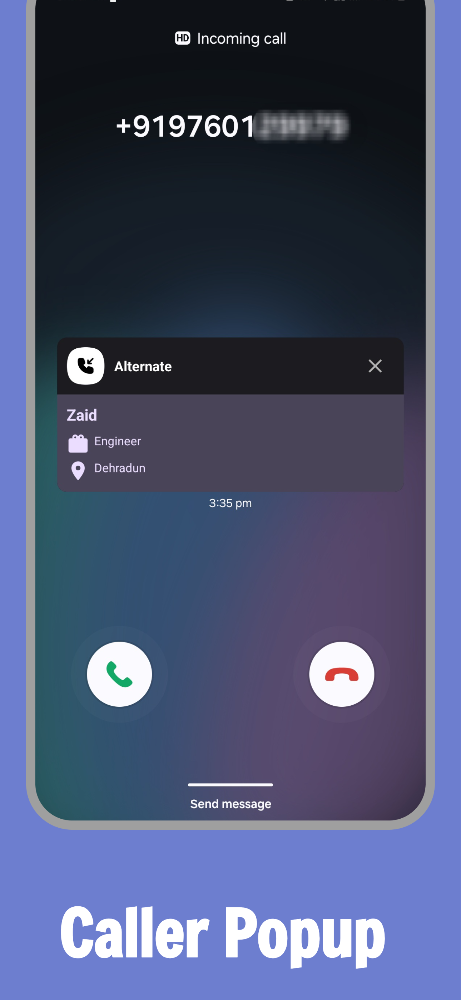
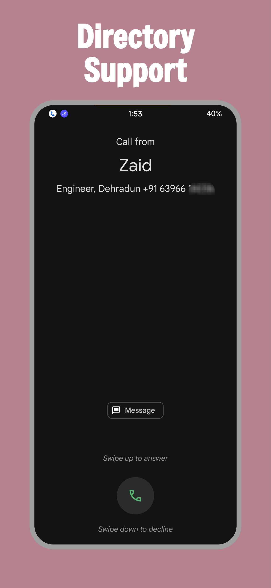

[![IzzyOnDroid][izzyondroid-shield]][izzyondroid-url]
[![Reproducible][reproducible-shield]][reproducible-url]
[![Releases][releases-shield]][releases-url]

[![Contributors][contributors-shield]][contributors-url]
[![Forks][forks-shield]][forks-url]
[![Stargazers][stars-shield]][stars-url]
[![Issues][issues-shield]][issues-url]
[![MIT License][license-shield]][license-url]

<div align="center">
<a href="https://github.com/BioHazard786/Alternate">
    
</a>
<br />
<br />
<a href=https://github.com/BioHazard786/Alternate/releases">Download</a>
    ·
    <a href="https://github.com/BioHazard786/Alternate/issues">Report Bug</a>
    ·
    <a href="https://github.com/BioHazard786/Alternate/issues">Request Feature</a>
    <br />
    <br />
</div>

# Alternate - Local Caller ID Detector

A privacy-focused React Native app that helps you identify unknown callers without cluttering your device's main contact list. Perfect for temporary number storage when you need to know who's calling but don't want the number to appear in WhatsApp, Telegram, or other messaging apps.

## Features

- **Local Caller ID Detection**: Identify incoming calls using your private database
- **Temporary Number Storage**: Save numbers locally without affecting your main contacts
- **Privacy Protection**: Numbers won't appear in WhatsApp, Telegram, or other messaging apps
- **Phone Number Validation**: Smart phone number input with country selection
- **Custom Native Module**: Built-in caller ID functionality using Android's native capabilities
- **Country Selector**: Beautiful bottom sheet country picker with search
- **Material Design**: Modern UI following Material Design 3 principles
- **Offline Storage**: All data stored locally using Android's native SQLite database

## Use Case

When you receive calls from unknown numbers but don't want to save them to your main contact list:

- **Delivery drivers** - Know who's calling without adding to contacts
- **Service providers** - Temporary contractors, repair services, etc.
- **Business contacts** - People you interact with briefly
- **Privacy protection** - Keep your main contact list clean while still identifying callers

## Tech Stack

- **React Native** with **Expo**
- **TypeScript** for type safety
- **React Native Paper** for Material Design components
- **Room** for local data storage

## Screenshots

<p align="center">
  
  
  
</p>
<p align="center">
  
  
</p>

## Download

<a href="https://apt.izzysoft.de/packages/com.lulu786.Alternate"></a>

or

Download from [Releases Tab](https://github.com/BioHazard786/Alternate/releases)

## Installation

### Prerequisites

- Node.js (v18 or later)
- npm or yarn
- Expo CLI
- Android Studio (for Android development)
- Xcode (for iOS development, macOS only)

### Setup

1. Clone the repository:

```bash
git clone https://github.com/BioHazard786/Alternate.git
cd Alternate
```

2. Install dependencies:

```bash
npm install
```

3. Start the development server:

```bash
npx expo start
```

## Building APK

### Development Build

To build a development APK:

```bash
npx expo run:android
```

### Production Build with EAS

1. Install EAS CLI:

```bash
npm install -g eas-cli
```

2. Configure EAS:

```bash
npx eas build:configure
```

3. Build for Android:

```bash
npx eas build --platform android
```

### Local Production Build

To build a production APK locally without EAS:

#### Method 1: Quick Build (Debug-Signed)

For development and testing purposes:

1. Install dependencies:

```bash
npm ci
```

2. Build for Android:

```bash
cd android
./gradlew assembleRelease
```

**Note:** This creates a release APK but signed with debug keystore. The APK will be generated at `android/app/build/outputs/apk/release/`

#### Method 2: Properly Signed APK (Recommended for Distribution)

For production distribution, use Android Studio to create a properly signed APK:

1. **Open the project in Android Studio**:

   - Open Android Studio
   - Select "Open an existing Android Studio project"
   - Navigate to the `android` folder in your project
   - Click "OK"

2. **Generate Signed APK**:

   - Go to `Build` → `Generate Signed Bundle / APK`
   - Select "APK" and click "Next"
   - Choose "Create new..." to generate a new keystore or "Choose existing..." if you have one
   - Fill in the keystore details (store this information securely!)
   - Click "Next"
   - Select "release" build variant
   - Click "Create"

3. **Locate the signed APK**:
   - The signed APK will be generated in `android/app/release/`
   - This APK is properly signed and ready for distribution

**Important Notes:**

- Debug-signed APKs (from `./gradlew assembleRelease`) are fine for development and testing
- For Play Store or distribution to users, always use properly signed APKs from Android Studio
- APKs signed with different keystores cannot update each other on Android devices

## Project Structure

```
├── app/                    # Main app screens
├── components/            # Reusable components
├── constants/            # App constants
├── hooks/               # Custom hooks
├── lib/                 # Utility functions and types
├── modules/             # Custom native modules
│   └── caller-id/       # Caller ID native module with SQLite integration
├── store/               # State management
└── assets/              # Images and other assets
```

## How It Works

1. **Add Numbers Locally**: Save phone numbers with names in your private database
2. **Caller ID Detection**: When calls come in, the app checks against your local database
3. **Privacy Maintained**: Numbers remain completely separate from your device's contact list
4. **No Sync Issues**: Won't interfere with messaging apps or cloud contact syncing

## Benefits

- **Clean Contact List**: Keep your main contacts organized
- **Privacy Control**: Numbers stay private to this app only
- **No Messaging App Clutter**: Saved numbers won't appear in WhatsApp, Telegram, etc.
- **Temporary Storage**: Perfect for short-term contact needs
- **Offline Functionality**: Works completely offline with local SQLite storage

## Contributing

1. Fork the repository
2. Create your feature branch (`git checkout -b feature/amazing-feature`)
3. Commit your changes (`git commit -m 'Add some amazing feature'`)
4. Push to the branch (`git push origin feature/amazing-feature`)
5. Open a Pull Request

## License

This project is licensed under the MIT License - see the [LICENSE](LICENSE) file for details.

## Contact

Mohd Zaid - [Telegram](https://t.me/LuLu786) - bzatch70@gmail.com

Project Link: [https://github.com/BioHazard786/Alternate](https://github.com/BioHazard786/Alternate)

## Acknowledgments

- Thanks To dmkvsk for native module inspiration [Repo](https://github.com/dmkvsk/react-native-detect-caller-id)
- Thanks To SimpleNexus for call directory implementation [Repo](https://github.com/SimpleNexus/simplecallerid)

---

_Keep your contact list clean while never missing an important call again!_

<!-- MARKDOWN LINKS & IMAGES -->
<!-- https://www.markdownguide.org/basic-syntax/#reference-style-links -->

[contributors-shield]: https://img.shields.io/github/contributors/BioHazard786/Alternate.svg?style=for-the-badge
[contributors-url]: https://github.com/BioHazard786/Alternate/graphs/contributors
[forks-shield]: https://img.shields.io/github/forks/BioHazard786/Alternate.svg?style=for-the-badge
[forks-url]: https://github.com/BioHazard786/Alternate/network/members
[stars-shield]: https://img.shields.io/github/stars/BioHazard786/Alternate.svg?style=for-the-badge
[stars-url]: https://github.com/BioHazard786/Alternate/stargazers
[issues-shield]: https://img.shields.io/github/issues/BioHazard786/Alternate.svg?style=for-the-badge
[issues-url]: https://github.com/BioHazard786/Alternate/issues
[license-shield]: https://img.shields.io/github/license/BioHazard786/Alternate.svg?style=for-the-badge
[license-url]: https://github.com/BioHazard786/Alternate/blob/master/LICENSE
[releases-shield]: https://img.shields.io/github/downloads/BioHazard786/Alternate/total
[releases-url]: https://github.com/BioHazard786/Alternate/releases
[izzyondroid-shield]: https://img.shields.io/endpoint?url=https://apt.izzysoft.de/fdroid/api/v1/shield/com.lulu786.Alternate&logo=data:image/png;base64,iVBORw0KGgoAAAANSUhEUgAAADAAAAAwCAMAAABg3Am1AAADAFBMVEUA0////wAA0v8A0v8A0////wD//wAFz/QA0/8A0/8A0/8A0/8A0v///wAA0/8A0/8A0/8A0/8A0//8/gEA0/8A0/8B0/4A0/8A0/8A0/+j5QGAwwIA0//C9yEA0/8A0/8A0/8A0/8A0/8A0/+n4SAA0/8A0/8A0/+o6gCw3lKt7QCv5SC+422b3wC19AC36zAA0/+d1yMA0/8A0/+W2gEA0/+w8ACz8gCKzgG7+QC+9CFLfwkA0/8A0////wAA0/8A0/8A0/8A0/+f2xym3iuHxCGq5BoA1P+m2joI0vONyiCz3mLO7oYA0/8M1Piq3Ei78CbB8EPe8LLj9Ly751G77zWQ1AC96UYC0fi37CL//wAA0/8A0////wD//wCp3jcA0/+j3SGj2i/I72Sx4zHE8FLB8zak1kYeycDI6nRl3qEA0/7V7psA0v6WzTa95mGi2RvB5XkPy9zH5YJ3uwGV1yxVihRLiwdxtQ1ZkAf//wD//wD//wD//wD//wCn5gf//wD//wD//wD//wD//wAA0/+h4A3R6p8A0/+X1w565OD6/ARg237n9csz2vPz+gNt37V/vifO8HW68B/L6ZOCwxXY8KRQsWRzhExAtG/E612a1Rd/pTBpmR9qjysduKVhmxF9mTY51aUozK+CsDSA52T//wD//wAA0////wD//wBJ1JRRxFWjzlxDyXRc0pGT1wCG0CWB3VGUzSTh8h6c0TSr5CCJ5FFxvl6s4H3m8xML0/DA5CvK51EX1N+Y2gSt4Dag3ChE3fax2ki68yO57NF10FRZnUPl88eJxhuCxgCz5EOLwEGf1DFutmahzGW98x0W1PGk3R154MHE6bOn69qv3gy92oG90o+Hn07B7rhCmiyMwECv1nO+0pQfwrCo57xF2daXsVhKrEdenQAduaee1Bsjr42z5D9RoCXy+QNovXpy2Z5MtWDO/TiSukaF3UtE1K6j3B4YwLc5wXlzpyIK0u5zy3uJqg4pu5RTpkZmpVKyAP8A0wBHcExHcEyBUSeEAAABAHRSTlP///9F9wjAAxD7FCEGzBjd08QyEL39abMd6///8P/ZWAnipIv/cC6B//7////////L/1Dz/0D///////86/vYnquY3/v///5T//v///17///////////////84S3QNB/8L/////////////7r/////NP////9l/////wPD4yis/x7Ym2lWSP+em////0n////////v///////////////////7//7pdGN3Urr6/+v/6aT////+//H/o2P/1v+7r7jp4PM/3p4g////g///K///481LxO///v////9w////8v/////9/p3J///a+P9v/5KR/+n///+p/xf//8P//wAAe7FyaAAABCZJREFUSMdj+E8iYKBUgwIHnwQ3N7cEHxcH+///VayoAE0Dh41qR7aBnCIQ8MsJKHH9/99czYYMWlA0cIkJGjMgAKfq//9RNYzIgLcBWYOTiCgDMhDn+B9bh6LebiWyH6L5UZQzONoAHWSHoqEpDkkDsyKqelv1//9rG1HUN9YihZK9AKp6BkG+/6xNqA5ajhSsCkrIipmYGGRa//9vQXVQXSySBnkWJOUMfn5Myuz/G3hR1NdEIUUchwiy+bkTsg4dbW/fu6W/e1c3XMMy5JiOZkFxUFZo74mgKTqaKXu0+2HqVwkja3BH9kFu361JwcHTfPJD4mdfe8ULAdVRyGlJAcVFfg+CQOozZ4XrJ85+JgwBsVXIGriQw5Tp4ZScezd8JiWnBupru30qwJZa+ZAjmWlC8fUZM4qB6kPnLNSPLMWqQQ5ZQ5aOzs1HmamBaQHzFs6y+qAmJCTE8f9/QgKSBg4DJPWc6zVDQkIC09JkZSPD38kukpExFpT4z67uYI/QwCOOCCK/izvu5CWl6AcEWMnKWml7LWbKZfH9/99UkknQHhGsynDz+65eWXv3/JmJrq5eXienVlRUfH/z8VvCf45soKQIH1yDEQsszrp6gwq9C73T87xcXadKl5TkFev4A/2tygmSBqYXqAYJmK+ZuoJydDR1vP09DA0NOy2kpdML81+U/heCpH1JU3jig7lJ5nKOT4i/t6ZHkqGzs4lJmIVHfrj+JR4HqLQSD0yDkCNEpGNn5ix9D03/eJdElTZdKV2TpNOhkwt8YUlNUgimgV0dLMBvf1gz1MolPd5FRcVNSkpDQ8owJeBCDyIhrIDnOD5QcuIU+3/2QKSs9laQ+noNLS0zLWdtqyP7mBAFAw88TwsJgMuJYweBGjYngtWbmeuZOW+bvNQToUFOAlFqOBk4Ov3/L7Z60/aN0p1tUhpa5nqWlub7C3p2I9QzyAghlUvczOz/1fhzPT3XSIfpSmmYAdVbmm1gV0dSz8DSilpUQsqCddIWIA3meuZaJqdMJZEzl6gRqgZIWZAxUdoizERXN8yi5MltcZTChzMaRQM3JNUWHS8rL/+yaPGvMmvr5ywoGoxtkDWwQ+Pb89ycBeWfGSJeL/la+RS1eOPnRtbQKgMRjZg+t8x6PkP273nWQAoFOPAgaeAThKXAmXMrK39Kmr5fsuBlBqoXfJGLe3VbmHjG9Mczi9T//3h7vygXtcDlQtJg44iQiIjIBRbGPO7gghPJy0ZIxT2HOLIUgwxQzsgYrUR350HSIMaJLidhgKY+mw+pflBDrX8E7OGBjPCAPc76gQFSTqAIiYrb/8dRP4CyosJ/rmwU5XIxHMilt4QBJwsSkBMClxOQULBlkRRwEONmR2kJcDGjADX2/+xO8r5iqjExqmLyrWpcPFRta1BfAwCtyN3XpuJ4RgAAAABJRU5ErkJggg==
[izzyondroid-png]: https://gitlab.com/IzzyOnDroid/repo/-/raw/master/assets/IzzyOnDroid2.png
[izzyondroid-url]: https://apt.izzysoft.de/packages/com.lulu786.Alternate
[reproducible-shield]: https://shields.rbtlog.dev/simple/com.lulu786.Alternate
[reproducible-url]: https://shields.rbtlog.dev/com.lulu786.Alternate
